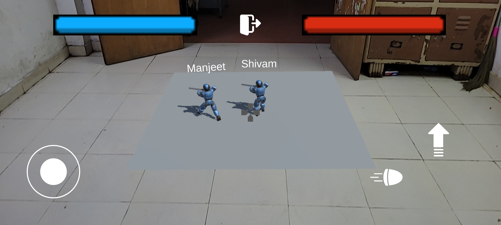

# RoboWars


## Team Members

PRIYANSHU AGRAWAL

SHIVAM 

ABHISHEK TIWARI

MANJEET 

SARTHAK AGARWAL

ADITYA SHARMA

SURYA KANTA GHOSH 

## About the Game
<br>

<br>
Welcome to RoboWars, an exhilarating online multiplayer game that takes robot battles to a whole new level using Augmented Reality (AR) technology. Get ready to engage in thrilling head-to-head battles as you control powerful robots in intense combat scenarios!

### Gameplay:
<br>

<br>

<br>
RoboWars puts you in the driver's seat of a formidable robot. The objective of the game is simple but exhilarating - be the last robot standing! Engage in fast-paced battles against another player-controlled robot and strategically eliminate your opponent to emerge victorious.
<br>


### Augmented Reality Experience:
<br>

<br>
RoboWars leverages the power of Augmented Reality, providing an immersive and interactive gaming experience like no other. Using your mobile device's camera, the game brings the intense battles right into your real-world environment. Witness your robots come to life as they engage in epic clashes amidst your surroundings, transforming your living room, backyard, or any chosen location into a battleground.

### Multiplayer Battles:
<br>

<br>
RoboWars truly shines in its multiplayer component, allowing you to challenge players from around the world in real-time battles. Connect with friends or face off against skilled opponents in thrilling one-on-one matches.

### Strategic Combat:
<br>

<br>

<br>
RoboWars requires both skillful piloting and tactical decision-making. Analyze your opponent's movements, anticipate their attacks, and find the perfect timing to strike. Every move counts in this intense battle for robotic supremacy!

<br>
<br>

## Build the project
To build the project, first clone the repository.
```
git clone https://github.com/I-am-Octavian/RoboWars.git
```
Now install [Unity Hub](https://unity.com/download)

Once in Unity Hub, you need to install a Unity editor. To build this project, we have used editor version 2022.2.14f1

**NOTE:** Unity projects are NOT backwards compatible. Sometimes newer versions may also stuff. You need to have the same editor version for best compatibility.

Now click on "Open"


Locate and open the project


Then navigate to File -> Build Settings. And switch platform to Android
**Add image here**

Finally Build the project to generate an APK. Install the APK on any suppported Android device and enjoy the game!
**Add image here**

## References
* Multiplayer Unity Game Template - https://github.com/pulsingcoder/TemplateForMultiplayerGame
* Photon Networking 2 - https://www.youtube.com/playlist?list=PLkx8oFug638oMagBH2qj1fXOkvBr6nhzt
